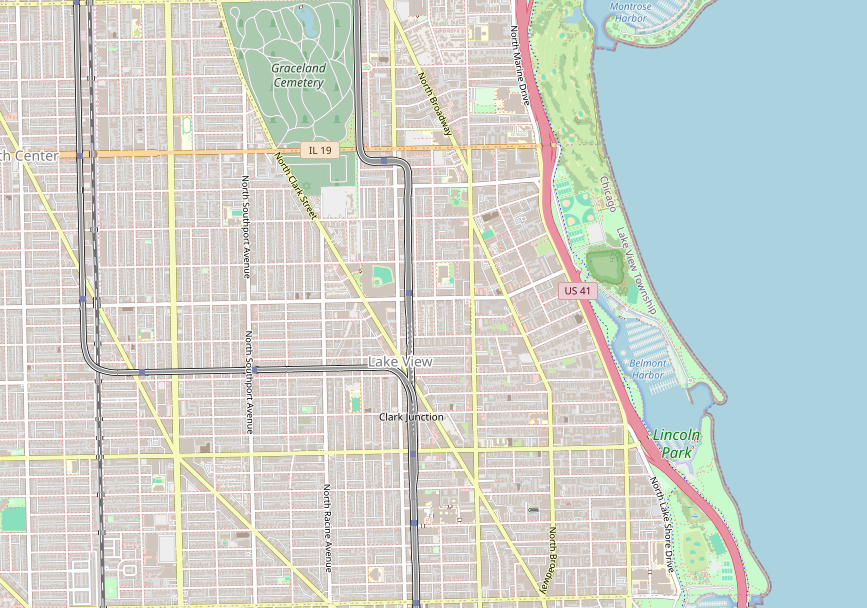

# Tour de Lake View

On July 5th, 2025 the prestigeous Tour de France will kick off in Lille and wind 2,063 miles to a finish at the Champs-Élysées in Paris. On July 13th, I will attempt to traverse every street in Lake View, Chicago in what will be known as the Tour de Lake View. This project is about the challenge of finding the optimal route for said traveral.

## Lake View

For the purpose of clarity, I will be using the following as the boundaries of Lake View

* Irving Park Road + Montrose Avenue to the North
* Ravenswood Avenue to the West
* Diversey Parkway to the South
* Clark Street and Lake Michigan to the East
